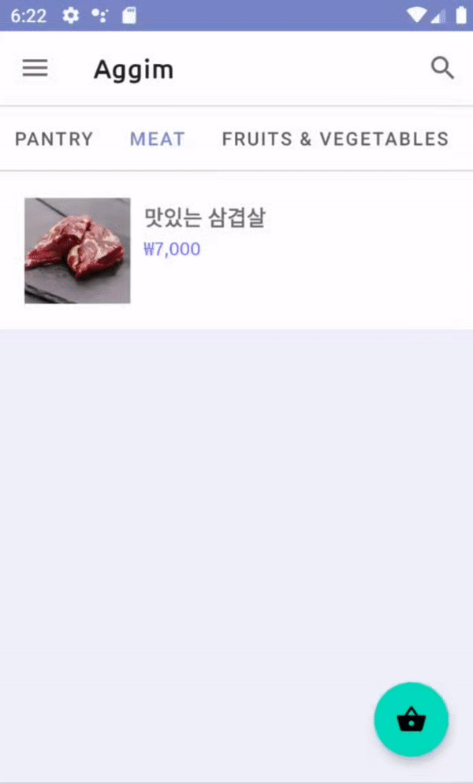
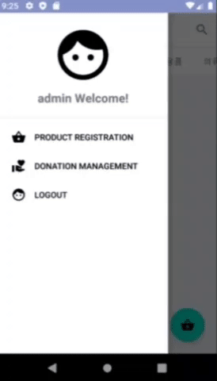
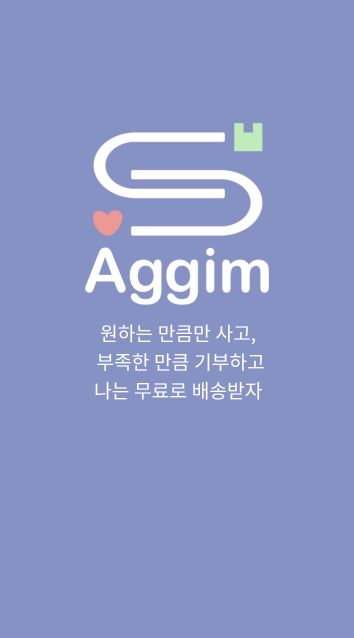
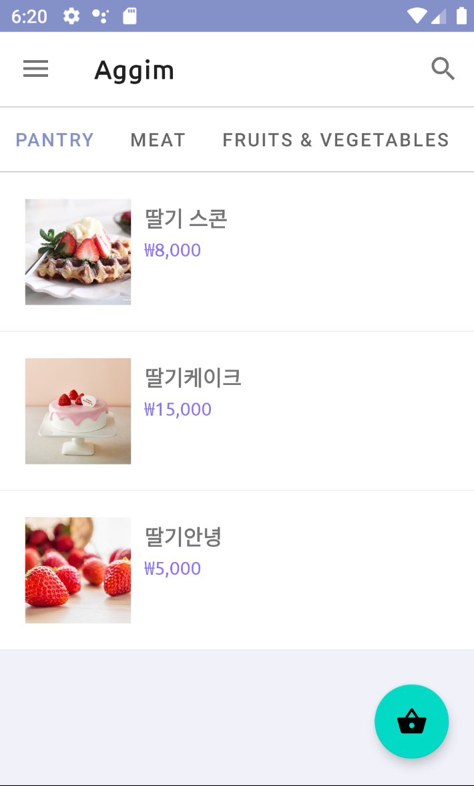
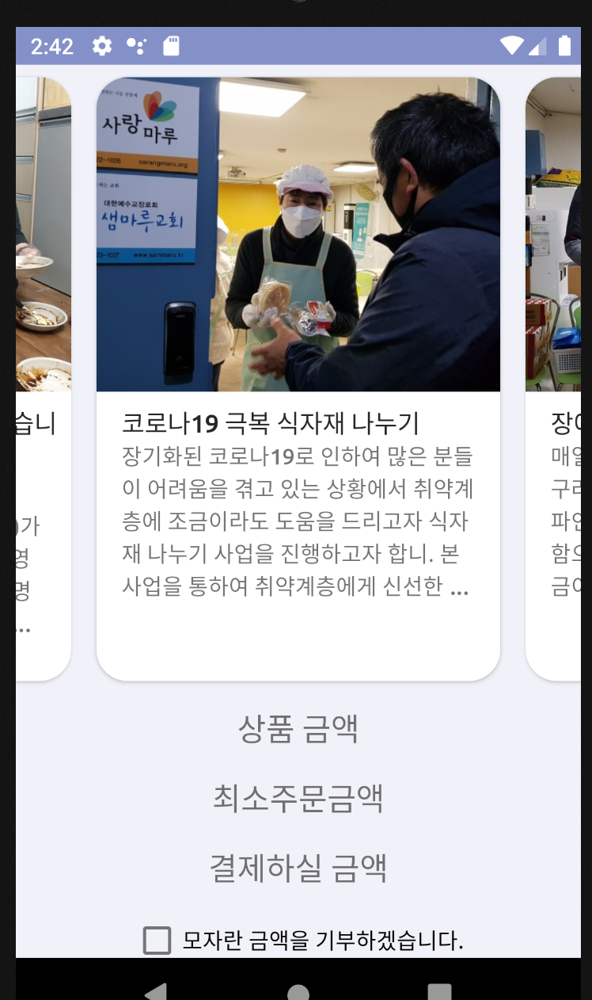
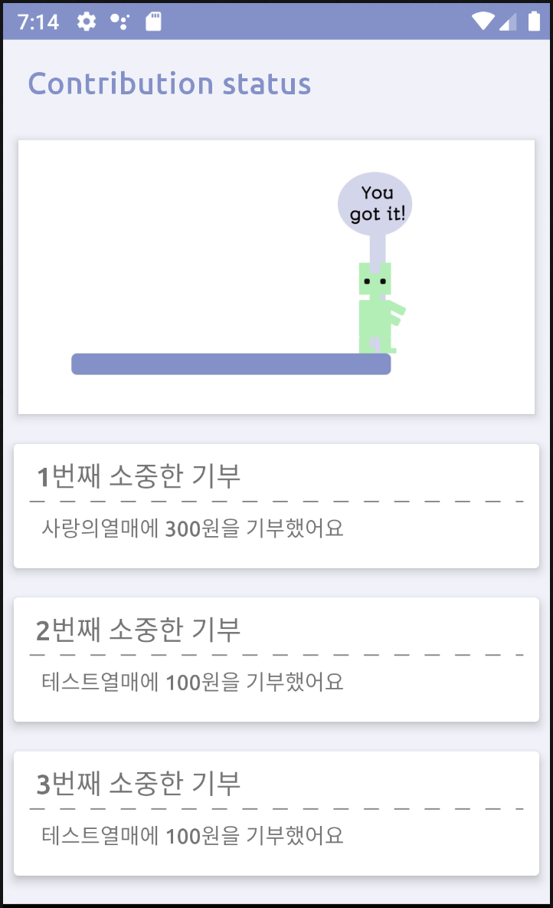

# 2021-Aggim-Market

## 서비스 소개
* 서비스명 : 아낌 없이 주는 마켓
* 주제 : 
  - 빈곤 퇴치(No Poverty)를 위해, 온라인 커머스 플랫폼 상에서 기부할 수 있도록 만든 어플리케이션
  - 물건을 구매할 때 기부할 물건을 선택하거나, 기부할 금액을 입력한다.
  - 내가 원하는 기부처나 사연을 보고 고를 수 있다. 주로 무료 급식소, 취약 계층을 위한 도시락 제작소 등을 타겟으로 한다. 그 곳에서 필요로 하는 식료품을 쉽게 기부할 수 있다.
  - 일상에서도 쉽게 기부할 수 있고, 기부하면 나도 혜택을 보는 1석 2조! 또한 스탬프와 '핵맨'컨셉의 재미요소(=기부 금액이 쌓일 수록 목표에 가까워지는 애니메이션)로 기부에 동기를 부여한다.

 
 
 

## 팀 소개
* 팀명 : 딸기케이크
* 팀원 : 김서현, 김민서, 이진, 이현진

## 담당 파트
* 김서현 : 서버 개발, 안드로이드 개발, 기획
* 김민서 : 안드로이드 개발, 기획
* 이진 : 안드로이드, ux/ui 디자인, 기획
* 이현진 : 영상 제작, 발표, 그래픽 디자인, 로고 제작

## 사용한 기술 스택
* Kotlin
* MySQL
* Spring Boot
* Hibernate

## 개발 환경
* JDK8
* Android Studio 4.x
* IntelliJ IDEA
* MySQL

